# 教育培训管理系统 
本系统主要面向社会上的培训机构和K12基础教育学校。涉及到教育教学的大部分方面。包括在线学习，题库管理，学员管理，班级管理，教材课程研发等等。
本系统包含后台管理系统，前端官网，学员学习中心，宗旨是尽量提供完善的版本直接使用，你只需要调整部分界面和风格即可交付给学员。
#### 功能介绍
1. 学员学员管理crm系统。 包括对学员的添加，禁用，启用，在线拨打电话，电话语音自动保存并回放，填写跟进记录。重置密码，办理其他业务等等。

2. 在线视频管理，提供对每一门教材可以按章节添加任意条数的视频地址管理。可以使用专业的流媒体播放器，也可以使用mp4等播放器。

3. 题库和考试作业，每一门教材的每一章节都可以添加试题， 学员可以使用小程序或者web学习中心进行在线考试。 每道题的题干和选项都可以使用图片代替文字，以便特殊符号的录入。

4. 购买课程管网，管理系统可以针对每个课程设置价格和学习日期，学员在线购买后即可在学习中心规定的时间内在线视频学习和刷题。并记录下错题和考试记录便于后续分析。

5. 分校区管理。理论上可以建立无数个分校区。并且每个分校区可以独立管理自己的官网（需要域名解析设置）。　各个分校区共享总部提供的教学教育资源。
6. 分校区官网管理，每个分校区的官网都有一套独立的cms界面，可以管理自己官网的新闻，优秀教师，课程购买等等，

7. 本系统采用了多语言国际化界面。用户可以随时切换中，英，繁体中文，日语。便于外语培训学校的老师使用。

8. 教师员工管理，针对每个老师的增删改查，以及设置他所教授的科目权限，便于他自我管理自己负责的教材视频内容和题库的管理。

9. 班级管理，每个校区可建立自己的班级列表。设置班主任 并对所有学员进行作业发放和批改回复。
 

#### 软件架构

本系统采用前后端分离的开发和运行模式。前端使用vue框架并基于vue-admin-element 模板进行开发。后端使用golang + redis + mysql 进行搭建　可单机运行也可集群运行。 对中小型培训机构的使用没有压力。　

#### 整体功能

#### 后端安装教程. 
如果你只需要开发前端程序。那么不需要下载后端程序即可直接使用公用的社区版api接口调试。待将要部署的时候再下载下面的后端程序。
后端程序采用的是go语言编写的。提供windows和linux版本供下载
需要后端项目的朋友请私信作者

#### 使用方法
1.  演示版本的地址  http://47.96.160.99:8083/ 
2.  如果需要使用在线拨打电话功能需要另外购买一台电话机通过usb连接电脑，大概400元。否则无法直接在网上拨打电话。
3.    [在线API文档地址 http://doc.todear.net:8990](在线API文档地址http://edudoc.todear.net:8990)

 #### 预览图
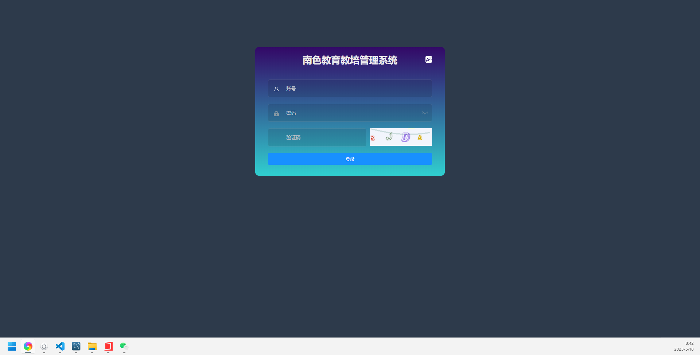 

## 登录页面。支持多语言选择

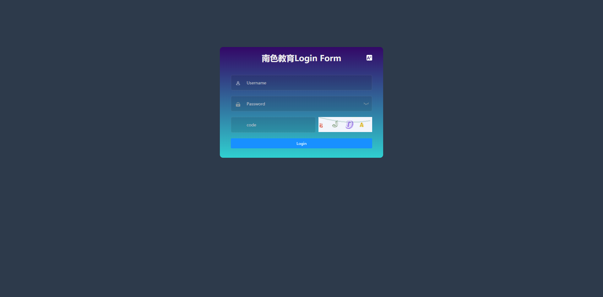
## 系统设置页面
可以自行修改公司的logo 和名称
 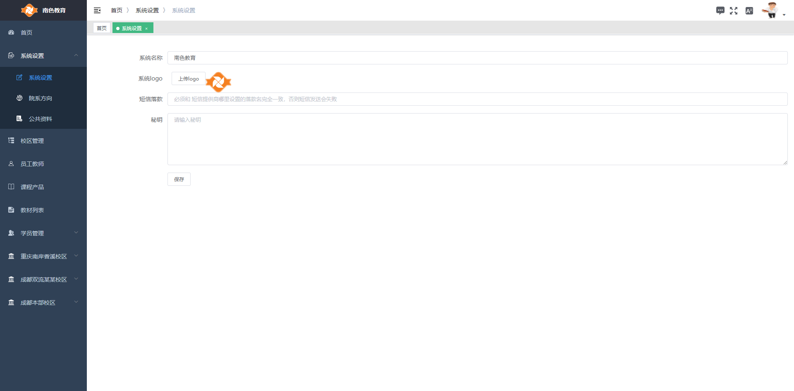

##数据仪表页面。
可以直观的看到员工的工作内容和占比

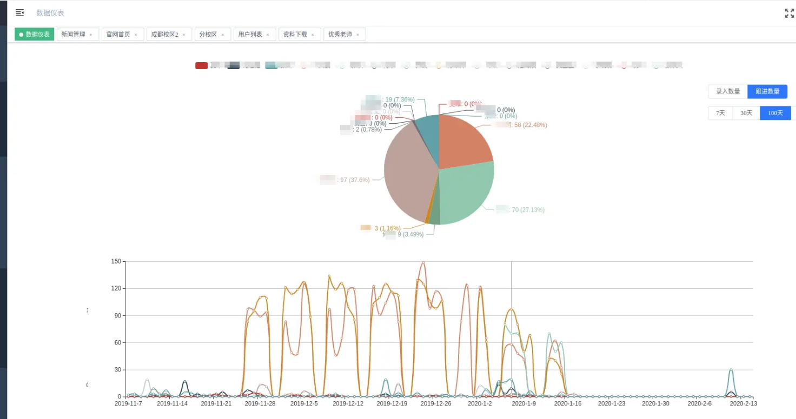

每个校区可以单独设置她拥有的资料权限级别。
 

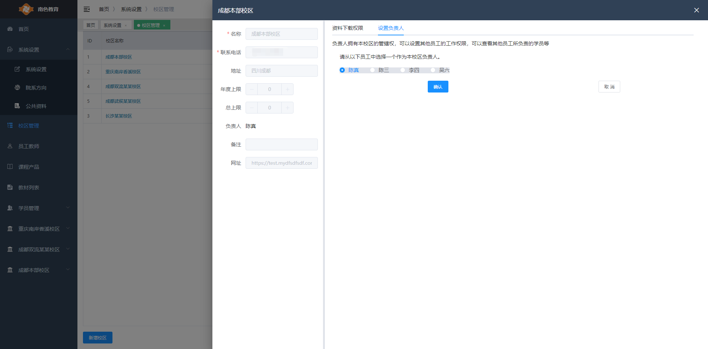

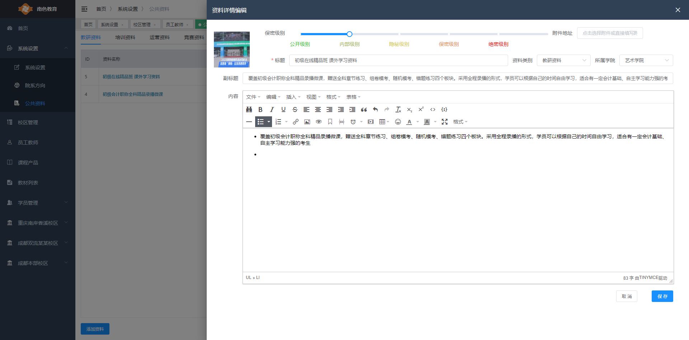
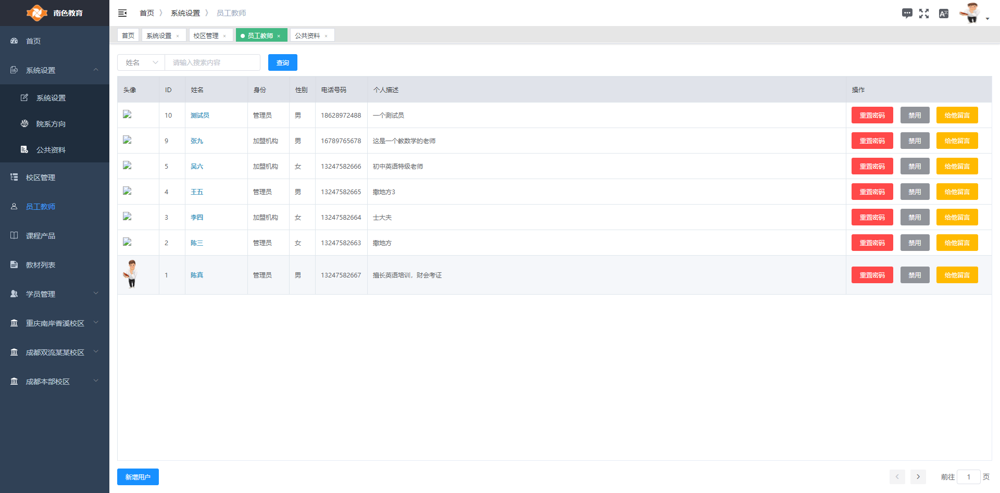

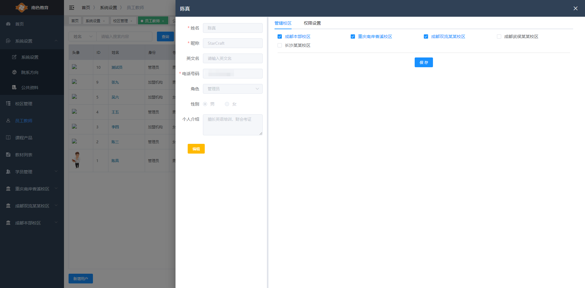

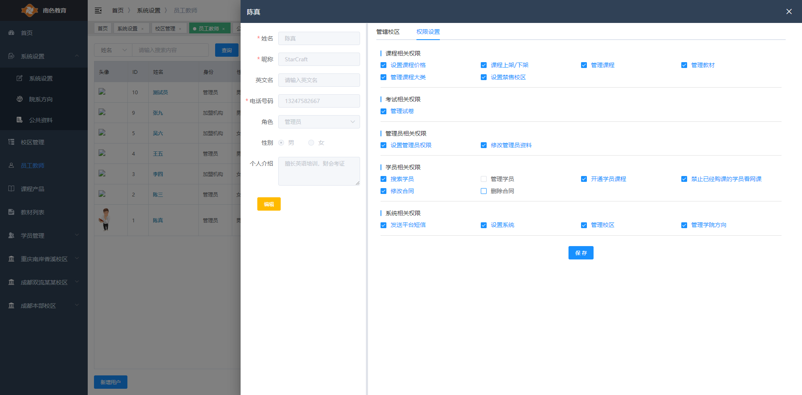

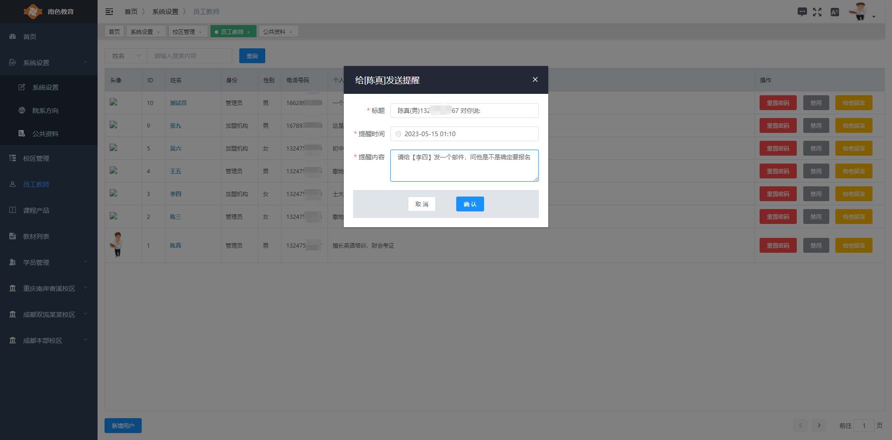

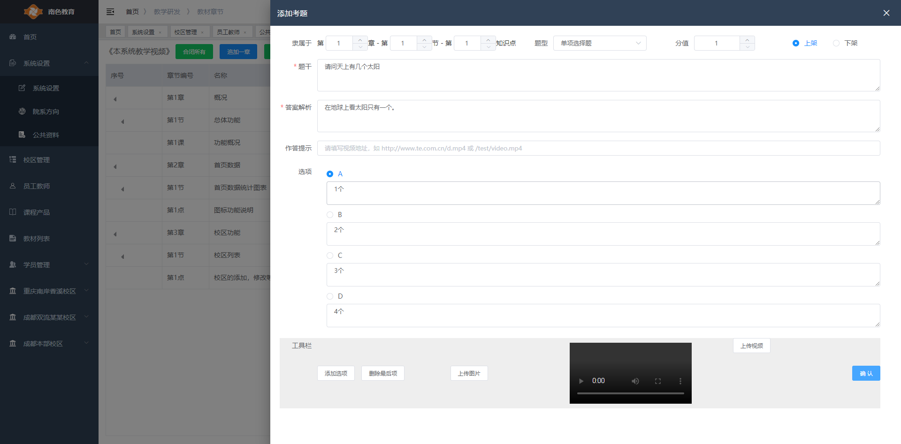

## 各校区网站的网页均可在线编辑

## 各校区网站的网页均可在线编辑

 
#### 参与贡献

1.  Fork 本仓库
2.  新建 Feat_xxx 分支
3.  提交代码
4. 新建 Pull Request

 